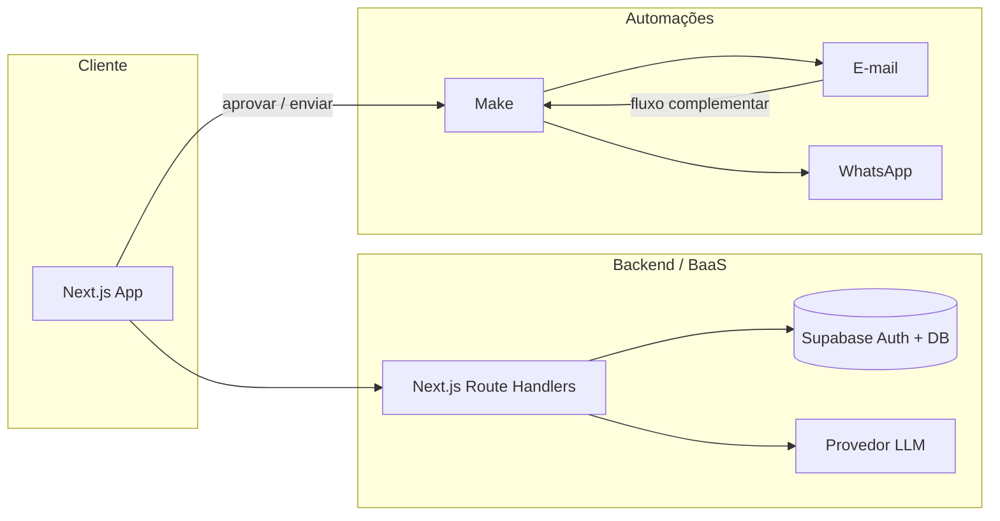
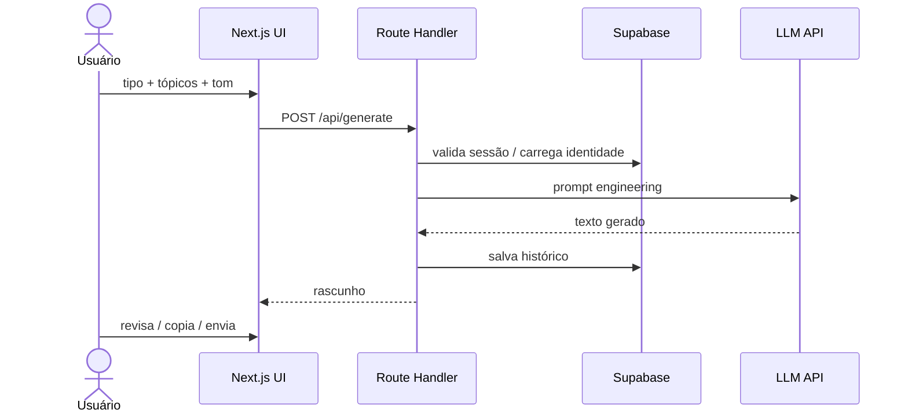
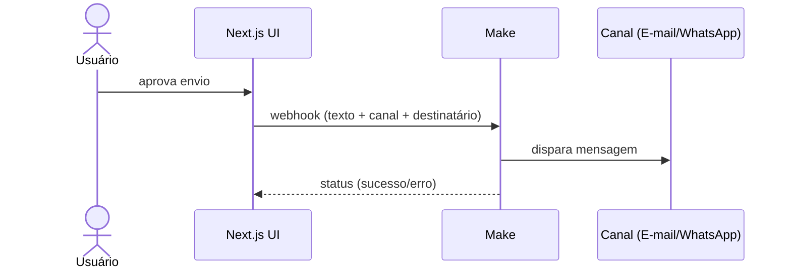
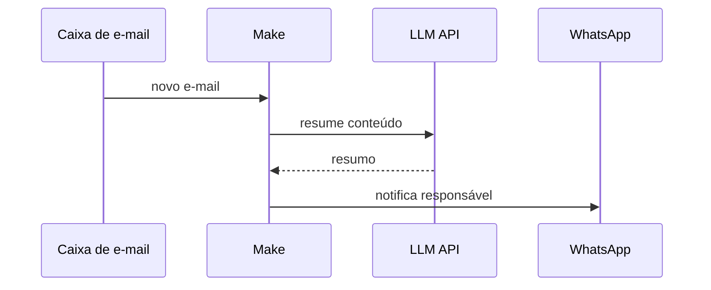

# Arquitetura — app-copilot-ia

Documento de arquitetura do protótipo de copiloto de comunicação interna para RH.
Alinha-se à resolução descrita em [desafio.md](./desafio.md).

---

## 1. Visão geral

O sistema é um assistente web que gera mensagens corporativas a partir de inputs
simples (tipo de texto, tópicos e tom de voz), usando LLM com prompt engineering.
Canais de e-mail e WhatsApp, orquestrados pelo Make, entram como entrega opcional
e como módulo complementar de triagem.



---

## 2. Objetivos arquiteturais

| Objetivo                                     | Como atendemos                                         |
| -------------------------------------------- | ------------------------------------------------------ |
| Resolver o enunciado (assistente de escrita) | Fluxo principal centrado em geração com LLM            |
| Manter o protótipo acessível                 | Next.js + Supabase + Make, sem infraestrutura pesada   |
| Separar núcleo e diferencial                 | Geração no app; envio/triagem no Make                  |
| Identidade organizacional                    | System prompt + dados de perfil/empresa no Supabase    |
| Segurança básica                             | Rotas protegidas, auth Supabase, chaves só no servidor |

---

## 3. Stack e responsabilidades

| Camada           | Tecnologia                                      | Responsabilidade                             |
| ---------------- | ----------------------------------------------- | -------------------------------------------- |
| Frontend         | Next.js (App Router) + TypeScript + Tailwind v4 | UI do assistente, dashboard, auth            |
| UI / formulários | shadcn/ui + React Hook Form + Zod               | Componentes, validação e estado de forms     |
| Auth / dados     | Supabase                                        | Login, sessão, perfil, histórico de gerações |
| IA               | Google Gemini API                               | Geração de textos via prompts                |
| Orquestração     | Make                                            | Webhooks de envio e monitoramento de e-mail  |
| Canais           | E-mail + WhatsApp                               | Entrega do texto ou alerta de triagem        |

---

## 4. Estrutura de pastas (alvo)

Estrutura prevista a partir do esqueleto já existente em `src/app`:

```
src/
  app/
    (auth)/
      signin/
      signup/
      layout.tsx          # layout público de autenticação
    (protected)/
      layout.tsx          # guard de sessão + shell logado
      dashboard/          # visão geral / atalhos
      assistant/          # núcleo: formulário + geração
      perfil/             # dados do usuário / identidade
    page.tsx              # landing / redirecionamento
    layout.tsx
    globals.css
  components/             # UI reutilizável (a criar)
  lib/
    supabase/             # client, server, middleware (a criar)
    prompts/              # templates de system/user prompt (a criar)
    make/                 # helpers de webhook Make.com
  types/                  # tipos de domínio (a criar)
docs/
  desafio.md
  architecture.md
```

---

## 5. Módulos funcionais

### 5.1 Autenticação

- Supabase Auth (e-mail/senha no MVP).
- Grupo de rotas `(protected)` só acessível com sessão válida.
- Grupo `(auth)` para sign-in / sign-up.

### 5.2 Assistente (núcleo)

Entrada do usuário:

- **Tipo de texto:** e-mail, WhatsApp, aviso institucional, resumo de reunião
- **Tópicos / contexto:** pontos-chave livres
- **Tom de voz:** formal, acolhedor, urgente, neutro, etc.

Processamento:

1. Route Handler no Next.js monta o prompt (system + user).
2. Chama a API do LLM **somente no servidor** (chave nunca no browser).
3. Retorna texto gerado para revisão na UI.
4. Persiste a geração no Supabase (histórico).

Saídas na UI:

- Visualizar / editar rascunho
- Copiar
- (Opcional) Enviar via Make (e-mail ou WhatsApp)

### 5.3 Identidade organizacional

Dados usados no prompt (MVP):

- Nome da empresa / área (RH, Comunicação Interna)
- Diretrizes de tom e restrições (ex.: linguagem clara, sem jargão)
- Assinatura ou fechamento padrão (quando aplicável)

Podem viver em tabela de perfil/configuração no Supabase e/ou em templates em
`src/lib/prompts`.

### 5.4 Dashboard

- Atalho para o assistente
- Últimas gerações
- (Fase 2) status do monitor de e-mails

### 5.5 Automações Make

**Entrega (pós-aprovação):**

```
Webhook Next.js → Make → E-mail e/ou WhatsApp
```

**Triagem (complementar):**

```
E-mail inbound → Make → resumo com LLM → WhatsApp ao responsável
```

O Make não substitui o assistente; apenas orquestra canais externos.

---

## 6. Fluxos principais

### 6.1 Geração de mensagem



### 6.2 Envio opcional



### 6.3 Triagem de e-mail (fase 2)



---

## 7. Prompt engineering

Princípios do MVP:

1. **System prompt** com persona de comunicação interna / RH.
2. **Variáveis controladas:** tipo de texto, tom, público, restrições de tamanho.
3. **Identidade:** nome da empresa e diretrizes salvas no Supabase.
4. **Few-shot opcional:** 1–2 exemplos por tipo de texto.
5. **Saída previsível:**
   - E-mail → assunto + corpo
   - WhatsApp → mensagem curta
   - Aviso → título + texto
   - Resumo → bullets + parágrafo final

Os templates devem ficar versionados em código (`src/lib/prompts`) para facilitar
demo e evolução acadêmica.

---

## 8. Modelo de dados (MVP sugerido)

### `profiles`

| Campo             | Tipo                 | Descrição                    |
| ----------------- | -------------------- | ---------------------------- |
| `id`              | uuid (FK auth.users) | Usuário                      |
| `full_name`       | text                 | Nome exibido                 |
| `company_name`    | text                 | Identidade organizacional    |
| `tone_guidelines` | text                 | Diretrizes de tom (opcional) |
| `created_at`      | timestamptz          | Criação                      |

### `generations`

| Campo        | Tipo        | Descrição                                      |
| ------------ | ----------- | ---------------------------------------------- |
| `id`         | uuid        | Identificador                                  |
| `user_id`    | uuid        | Autor                                          |
| `text_type`  | text        | email \| whatsapp \| notice \| meeting_summary |
| `tone`       | text        | Tom escolhido                                  |
| `topics`     | text        | Input do usuário                               |
| `result`     | text        | Texto gerado                                   |
| `created_at` | timestamptz | Criação                                        |

Políticas RLS: cada usuário lê/escreve apenas seus registros.

---

## 9. APIs internas (alvo)

| Método | Rota               | Função                                  |
| ------ | ------------------ | --------------------------------------- |
| `POST` | `/api/generate`    | Gera texto com LLM e persiste histórico |
| `GET`  | `/api/generations` | Lista histórico do usuário              |
| `POST` | `/api/send`        | Dispara webhook Make após aprovação     |

Contratos detalhados podem evoluir junto com a implementação.

---

## 10. Segurança e segredos

- Chaves de LLM, Supabase service role e webhooks Make apenas em variáveis de
  ambiente no servidor.
- Cliente browser usa apenas chave anônima do Supabase + sessão do usuário.
- Validar sessão em Route Handlers antes de gerar ou enviar.
- Não expor payloads sensíveis de e-mail no frontend sem necessidade.

---

## 11. Ambientes e variáveis (previsto)

```env
NEXT_PUBLIC_SUPABASE_URL=
NEXT_PUBLIC_SUPABASE_ANON_KEY=
# ou NEXT_PUBLIC_SUPABASE_PUBLISHABLE_KEY=

GEMINI_API_KEY=
LLM_MODEL=gemini-3.1-flash-lite
LLM_BASE_URL=https://generativelanguage.googleapis.com/v1beta
LLM_MOCK=false

MAKE_WEBHOOK_SEND_URL=
MAKE_WEBHOOK_SECRET=
```

Veja também `.env.example`, `docs/make/scenario.md` e o SQL em `docs/supabase/schema.sql`.

---

## 12. Fronteiras do MVP vs fase 2

| Incluído no MVP                         | Fase 2                                          |
| --------------------------------------- | ----------------------------------------------- |
| Auth + perfil básico                    | Multi-empresa / papéis (admin, RH)              |
| Assistente com 4 tipos de texto         | Templates avançados e bibliotecas               |
| Histórico de gerações                   | Analytics de uso                                |
| Copiar texto                            | Fila de aprovação formal                        |
| Webhook Make de envio (e-mail/WhatsApp) | Monitor e-mail → resumo → WhatsApp              |
| Prompt versionado em código             | Fine-tuning / avaliação automática de qualidade |

---

## 13. Decisões de design

1. **Assistente no centro** — o desafio exige geração a partir de inputs; canais
   externos são periféricos.
2. **Make.com** — automação low-code citada no enunciado; o app só dispara o webhook.
3. **LLM só no servidor** — simplifica segurança e controle de custo/prompt.
4. **Supabase como BaaS** — evita backend monolítico no protótipo acadêmico.
5. **Triagem de e-mail como diferencial** — agrega valor de RH sem desviar do MVP.

---

## 14. Próximos passos de implementação

1. Configurar Supabase (Auth + tabelas + RLS).
2. Implementar guard de sessão no layout `(protected)`.
3. Construir UI do `/assistant` e Route Handler `/api/generate`.
4. Versionar prompts e testar 2–3 tipos de texto na demo.
5. Configurar scenario Make (docs/make/scenario.md) e testar `/api/send`.
6. (Opcional) Workflow complementar de triagem de e-mail no Make.
